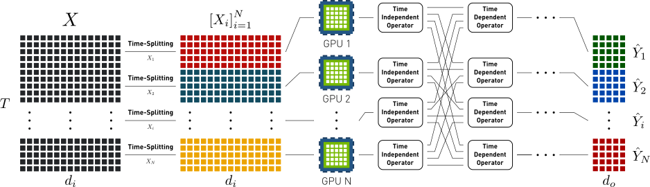

# distributed-dot-product
[](./LICENSE)

PyTorch implementation for an MPI-based dot-product attention distributed implementation

## Overview
This package provides a multi-GPU, operator-level distributed implementation of the main
linear operations involved in the dot product attention operator found in most
Transformer models and Non-local blocks, namely ,  and .

This implementation is based on the operator-level distribution framework presented in _Multi-GPU distribution of single-batch, time-dependent linear products_, on which a large input  of size  is distributed into  GPUs, where each input  is of size .



This package provides a distributed implementation for the [Multihead Dot Product Attention](./distributed_dot_product/module.py) operator. Additionally, it provides the distributed implementation of each of the [linear products](./distributed_dot_product/multiplication/functions.py), alongside their [derivatives](./distributed_dot_product/multiplication/functions.py). All the implementations are based on [Horovod](https://github.com/horovod/horovod) and [PyTorch](https://github.com/pytorch/pytorch) and require [OpenMPI](https://www.open-mpi.org/) and [NCCL2](https://developer.nvidia.com/nccl).


## Dependencies
In order to use this package, you will require the latest version of PyTorch and Horovod. We recommend using the Anaconda Python distribution and the conda package manager, as it follows:

```bash
# Install PyTorch
conda install pytorch torchvision cudatoolkit=10.2 -c pytorch

# Install Horovod
HOROVOD_ALLREDUCE="NCCL" pip install horovod
```

**Note:** Horovod requires OpenMPI and the NVIDIA Communications Library (NCCL) installed, please refer to the installation guide provided on each of the official project websites. This package has been tested on Linux, it works both for CPU and GPU nodes.

## Installing
To install distributed-dot-product, you can use pip:

```bash
# Using pip
pip install distributed-dot-product
```

## Usage
After installing the package, you can import any of the implementations provided as it follows:

### Multihead dot product attention
```python
from distributed_dot_product.module import DistributedDotProductAttn
from distributed_dot_product.utils.comm import get_rank, get_world_size

device = torch.device('cpu')

if torch.cuda.is_available():
    torch.cuda.set_device(get_rank())
    device = torch.device('cuda')

# Creating a distributed dot product module
attn = DistributedDotProductAttn(key_dim: int, value_dim: int = None,
                                 query_dim: int = None, num_heads: int = 1,
                                 add_bias: bool = False, offset: int = 32)

# Time dimension
length = N * node_length

# Total number of nodes available
N = get_world_size()

# Current node inputs
Xk_i = torch.rand(1, length // N, key_dim, device=device)
Xq_i = torch.rand(1, length // N, query_dim, device=device)
mask_i = torch.zeros(1, length // N, length, device=device)

# Calling the module
out_i = attn(Xk_i, Xq_i, Xq_i, mask_i)
```

We provide a sample [example](./example.py) that highlights how to use this
module, to execute it, please use the following instruction:

```bash
NCCL_DEBUG=INFO horovodrun -np <num-gpus> --mpi python example.py
```

Here `<num-gpus>` refers to the total number of GPUs to use (if CUDA is enabled), or the total number of processes to spawn (in CPU).

### Individual linear operators (with gradients)
```python
from distributed_dot_product.multiplication.ops import (
    RightTransposeMultiplication, FullMultiplication,
    LeftTransposeMultiplication)
from distributed_dot_product.utils.comm import get_rank, get_world_size

device = torch.device('cpu')

if torch.cuda.is_available():
    torch.cuda.set_device(get_rank())
    device = torch.device('cuda')

# Total number of elements to send per distribution step
offset = 32

# Time dimension
length = N * node_length

# Total number of nodes available
N = get_world_size()

## --------------------- A·B^T -------------------------
left = torch.rand(1, length // N, dim, device=device)
right = torch.rand(1, length // N, dim, device=device)
out = RightTransposeMultiplication.apply(left, right, offset)

## --------------------- A·B ----------------------------
left = torch.rand(1, length // N, length, device=device)
right = torch.rand(1, length // N, dim, device=device)
out = FullMultiplication.apply(left, right, offset)

## --------------------- A^T·B --------------------------
left = torch.rand(1, length // N, length, device=device)
right = torch.rand(1, length // N, dim, device=device)
out = LeftTransposeMultiplication.apply(left, right, offset)
```

### Functional linear operators
```python
from distributed_dot_product.multiplication.functions import (
    distributed_matmul_nt, distributed_matmul_tn, distributed_matmul_all
)
from distributed_dot_product.utils.comm import get_rank, get_world_size

device = torch.device('cpu')

if torch.cuda.is_available():
    torch.cuda.set_device(get_rank())
    device = torch.device('cuda')

# Total number of elements to send per distribution step
offset = 32

# Time dimension
length = N * node_length

# Total number of nodes available
N = get_world_size()

## --------------------- A·B^T -------------------------
left = torch.rand(1, length // N, dim, device=device)
right = torch.rand(1, length // N, dim, device=device)
out = distributed_matmul_nt(left, right, offset)

## --------------------- A·B ----------------------------
left = torch.rand(1, length // N, length, device=device)
right = torch.rand(1, length // N, dim, device=device)
out = distributed_matmul_all(left, right, offset)

## --------------------- A^T·B --------------------------
left = torch.rand(1, length // N, length, device=device)
right = torch.rand(1, length // N, dim, device=device)
out = distributed_matmul_tn(left, right)
```

## Running tests
We provide tests for the operator implementations and their gradients. To execute them, we require [pytest](https://docs.pytest.org/en/latest/) installed:

```bash
# Using conda (recommended)
conda install pytest

# Using pip
pip install pytest
```

Then, to execute the tests, it is possible to run:

```bash
# Operator parity tests
NCCL_DEBUG=INFO horovodrun -np <num-gpus> --mpi  pytest -vv -x distributed_dot_product/tests/test_gradient.py

# Gradient tests
NCCL_DEBUG=INFO horovodrun -np <num-gpus> --mpi  pytest -vv -x distributed_dot_product/tests/test_multiplication.py
```

**Note:** Some of the tests may need one or more runs, as they need the same exact order of execution on all nodes, which may vary, thus leading to failures.

## Contribution guidelines
We follow PEP8 and PEP257 for all python modules. We use MyPy type annotations for all functions and classes declared on this package. Feel free to send a PR or create an issue if you have any problem/question.
